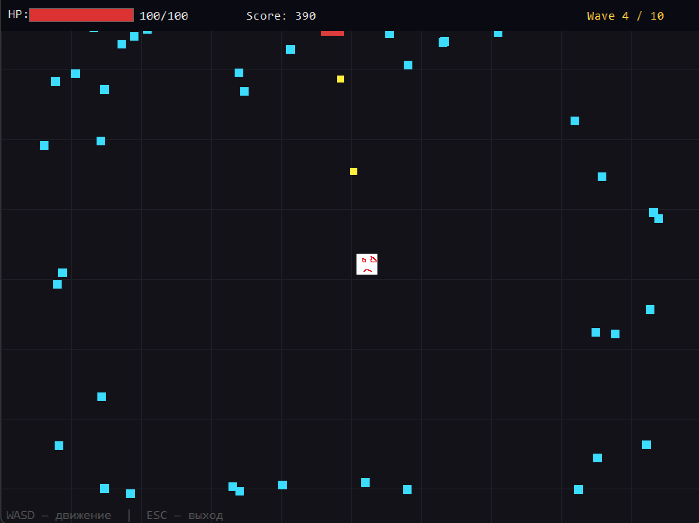
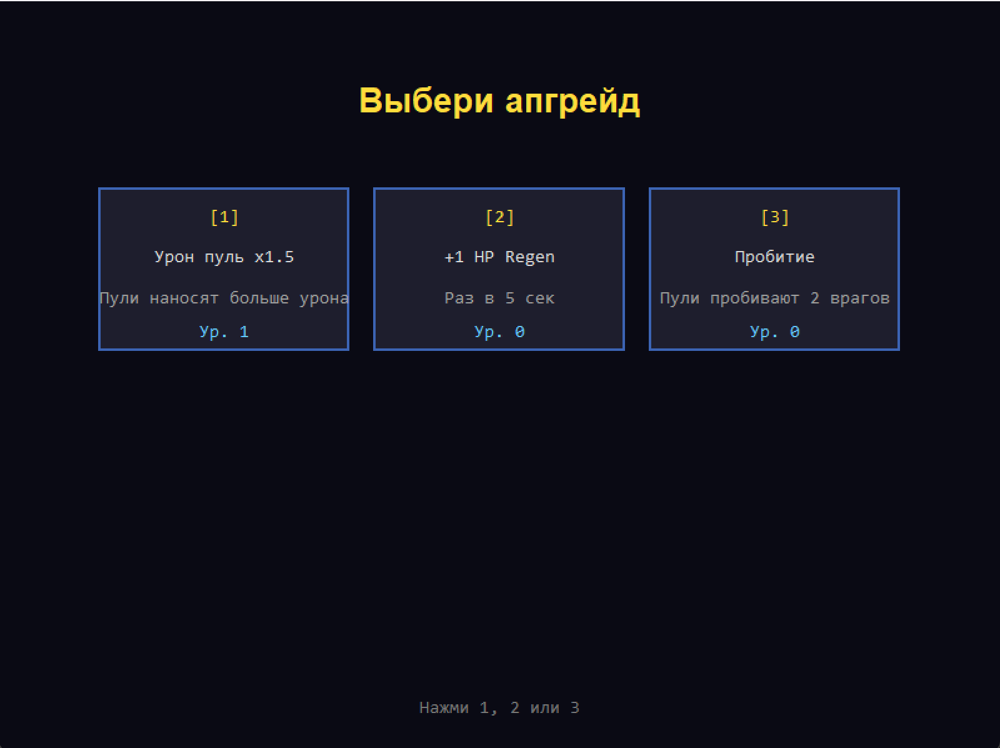

# Brotato-like — 2D шутер на C + Win32 API

Семестровый проект по курсу «Языки программирования».  
Жанр: top-down arena shooter с волнами врагов и системой апгрейдов.

---

## Описание игры

Игрок находится в центре арены и автоматически стреляет по ближайшему врагу.  
Цель — пережить 10 волн нарастающей сложности. После каждой волны предлагается выбор одного из трёх улучшений.

### Враги

| Тип | Скорость | HP | Особенность |
|-----|----------|----|-------------|
| Обычный | средняя | мало | базовый |
| Быстрый | высокая | мало | появляется с волны 3 |
| Танк | низкая | много | появляется с волны 5, даёт 3 XP |

### Апгрейды

| # | Название | Эффект |
|---|----------|--------|
| 1 | HP Regen | +1 HP каждые 5 сек |
| 2 | Скорость +20% | игрок движется быстрее |
| 3 | Урон пуль x1.5 | пули наносят больше урона |
| 4 | Скорострельность | кулдаун стрельбы −25% |
| 5 | Пробитие | пули пробивают 2 врагов |
| 6 | +30 Max HP | увеличивает максимальный запас HP |

---

## Управление

| Клавиша | Действие |
|---------|----------|
| `W A S D` / стрелки | движение игрока |
| `1` / `2` / `3` | выбор сложности в меню / выбор апгрейда |
| `R` | перезапуск после смерти или победы |
| `ESC` | выход |

---

## Сборка

### Требования

- Windows 10/11 (x64)
- Visual Studio 2022 с компонентом «Разработка классических приложений на C++»
- Компилятор: MSVC (cl.exe), стандарт C11

### Через Visual Studio

1. Открыть `sem.slnx`
2. Выбрать конфигурацию `Debug | x64` или `Release | x64`
3. Build → Build Solution (`Ctrl+Shift+B`)
4. Исполняемый файл появится в `x64/Debug/sem.exe` или `x64/Release/sem.exe`

### Через командную строку (Developer Command Prompt)

```bat
cl /std:c11 /W3 /D_CRT_SECURE_NO_WARNINGS ^
   src\main.c src\core.c src\ui.c ^
   /Fe:sem.exe ^
   /link user32.lib gdi32.lib msimg32.lib /SUBSYSTEM:WINDOWS
```

### Запуск

Запускать из корня репозитория — рядом с `sem.exe` должна находиться папка `assets/`:

```
sem.exe
assets/
  player.bmp
```

---

## Архитектура

Проект разделён на два независимых модуля:

### `src/core.c` + `src/core.h` — игровая логика
- Структура `GameState` — единственный объект состояния игры
- Движение и коллизии игрока и врагов (AABB)
- Система волн, спавн врагов, масштабирование HP
- Автострельба по ближайшему врагу
- Апгрейды, XP-гемы, фазы игры

### `src/ui.c` + `src/ui.h` — интерфейс и отрисовка
- Создание Win32-окна, обработка сообщений (`WndProc`)
- Опрос ввода через `GetAsyncKeyState`
- Двойная буферизация: `CreateCompatibleDC` + `BitBlt`
- Отрисовка всех экранов: меню, игра, апгрейд, смерть, победа
- Загрузка и рендер спрайтов через `LoadImage` / `BitBlt`

**Правило разделения:** `core.c` не знает о `HWND`, `HDC` и любых Win32-типах. Взаимодействие только через `GameState*`.

### `src/main.c` — точка входа
- Игровой цикл с фиксированным шагом (`QueryPerformanceCounter`, шаг 1/60 сек)
- Защита от spike-значений `dt > 0.1f`

---

## Использованные ресурсы

| Файл | Назначение |
|------|------------|
| `assets/player.bmp` | спрайт игрока (24×24 px) |

---

## Скриншоты

### Игровой процесс


### Экран выбора апгрейда

